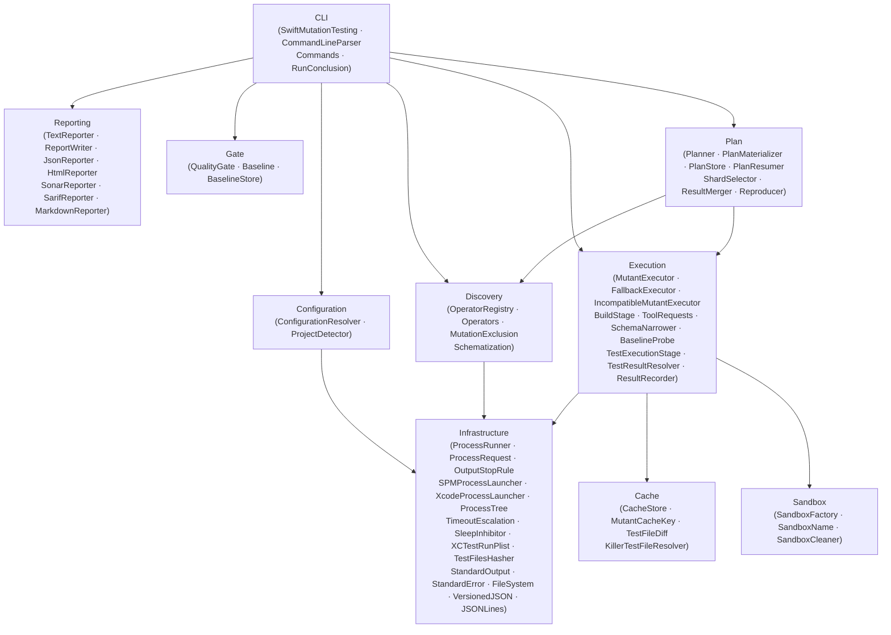
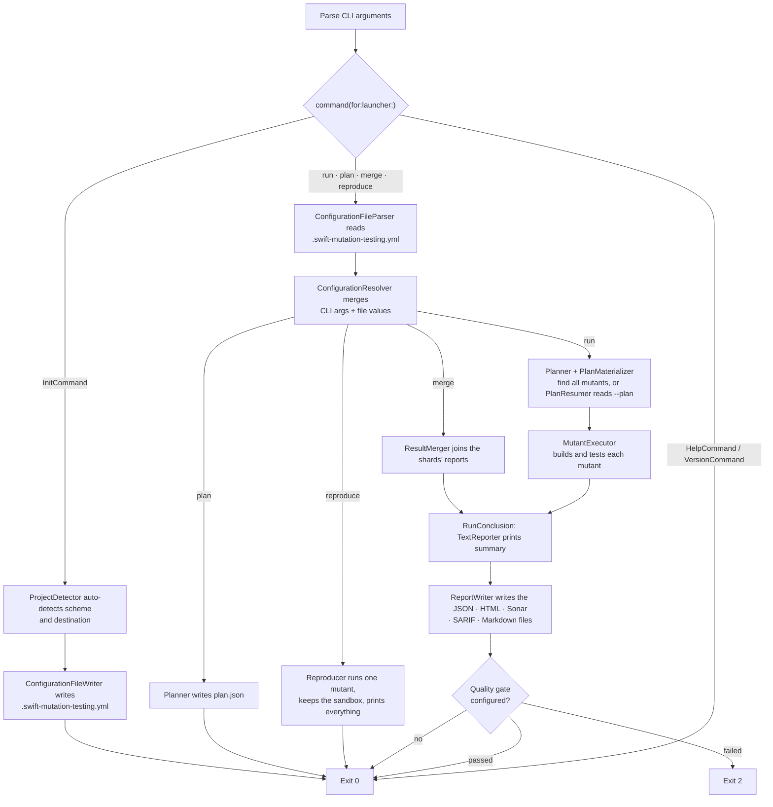
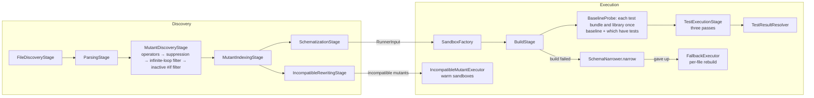

# Overview

← [Index](README.md) | Next: [Discovery Pipeline →](02-discovery.md)

---

## Purpose

`swift-mutation-testing` is a mutation testing CLI for Swift projects (Xcode and SPM). It introduces controlled faults (mutants) into source code, runs the test suite for each one, and reports whether the tests detected the fault. The mutation score — the ratio of killed mutants to all testable mutants — measures the effectiveness of the test suite.

The tool never modifies the original project. All mutations happen inside isolated sandbox copies in `$TMPDIR`.

## Module Map

The codebase is organized into six layers. Each has a single responsibility and communicates through well-defined value types.

| Layer | Responsibility |
|---|---|
| **CLI** | Argument parsing, one `Command` per subcommand, the end of a run (`RunConclusion`), exit codes |
| **Configuration** | Config file parsing, CLI merge, auto-detection of scheme and destination |
| **Discovery** | Source file collection, AST parsing, mutant identification (`OperatorRegistry`, `MutationExclusion`), mutant ids (`MutantID`), schematization |
| **Execution** | Build (`ToolRequests`), schema narrowing (`SchemaNarrower`), the baseline probe (`BaselineProbe`), simulator management, parallel test execution, result parsing (Xcode and SPM), recording verdicts (`ResultRecorder`), fallback per-file builds |
| **Sandbox** | Sandbox creation (`SandboxFactory`), orphaned sandbox cleanup and signal-based cleanup (`SandboxCleaner`) |
| **Cache** | Granular per-file cache invalidation (`CacheStore`, `TestFileDiff`), killer test file resolution (`KillerTestFileResolver`), cache key computation (`MutantCacheKey`) |
| **Reporting** | Progress output, mutation report generation (text, and JSON, HTML, Sonar, SARIF, Markdown files written by `ReportWriter`) |
| **Gate** | Quality gate policies, baselines of undetected mutants matched by fingerprint, gate exit code |
| **Plan** | What a run will do, written down: `Planner` makes it, `PlanMaterializer` turns it into the execution input, `ShardSelector` slices it, `ResultMerger` joins the slices' results, `Reproducer` runs one mutant of it, `PlanResumer` picks a run of it up from its journal |
| **Infrastructure** | Process lifecycle management (`ProcessRunner`, `ProcessRequest`, `SPMProcessLauncher`), xctestrun plist manipulation, test file hashing, capturable stdout and stderr (`StandardOutput`, `StandardError`), injectable file-system calls (`FileSystem`), versioned JSON and JSON-lines files (`VersionedJSON`, `JSONLines`) |

## Entry Point

`SwiftMutationTesting.swift` is the `@main` entry point. It parses the arguments into `ParsedArguments`, turns them into a `Command` with `command(for:launcher:)` — `HelpCommand`, `VersionCommand`, `InitCommand`, `PlanCommand`, `MergeCommand`, `ReproduceCommand` or `RunCommand`, each built with the resolved configuration it needs — and returns what its `execute()` returns. A run and a merge both end in `RunConclusion`.

## Both Pipelines at a Glance

| Stage | Input | Output |
|---|---|---|
| `Planner` | `DiscoveryInput` | `Plan` + `[ParsedSource]` (the four stages below) |
| `PlanMaterializer` | `Plan` + `[ParsedSource]` (or the files on disk, hashed again) | `RunnerInput` (the two schematization stages) |
| `FileDiscoveryStage` | `DiscoveryInput` | `[SourceFile]` |
| `ParsingStage` | `[SourceFile]` | `[ParsedSource]` |
| `MutantDiscoveryStage` | `[ParsedSource]` | `[MutationPoint]` |
| `MutantIndexingStage` | `[MutationPoint]`, `[ParsedSource]` | `[IndexedMutationPoint]` |
| `SchematizationStage` | `[IndexedMutationPoint]`, `[ParsedSource]` | `[SchematizedFile]`, `[MutantDescriptor]` |
| `IncompatibleRewritingStage` | `[IndexedMutationPoint]`, `[ParsedSource]` | `[MutantDescriptor]` |
| `SandboxFactory` | project path + schematized files | `Sandbox` |
| `BuildStage` | `Sandbox` | `BuildArtifact` |
| `TestExecutionStage` | `BuildArtifact` + mutants | `[ExecutionResult]` |
| `FallbackExecutor` | `RunnerInput` + `SimulatorPool` | `[ExecutionResult]` |
| `IncompatibleMutantExecutor` | incompatible mutants | `[ExecutionResult]` |
| `TestResultResolver` | `TestLaunchResult` + `ProjectType` | `TestRunOutcome` |

## Invariants

| Invariant | Enforcement |
|---|---|
| Original project is never modified | All mutations happen inside `$TMPDIR/swift-mutation-testing/xmr-<pid>-<UUID>/` sandbox |
| Build runs exactly once for the normal path | `BuildStage` builds once (Xcode: `build-for-testing`, SPM: `swift build --build-tests`); `TestExecutionStage` uses `test-without-building` (Xcode) or `swift test --skip-build` (SPM) |
| No mutant results are lost or duplicated | `MutationCounter` tracks total; `withThrowingTaskGroup` accounts for every task |
| Mutant positions are accurate | UTF-8 offsets are preserved from AST through to final report |
| A cancelled task never permanently holds a simulator slot | `withTaskCancellationHandler` in `SimulatorPool.acquire` releases the slot on cancel |
| Every schematized file declares its own support block, named after the file | `SchemataGenerator` ends every file it schematizes with `SupportDeclarations.appended(to:path:syntax:style:)`, which adds `perFile(for:)`: `@usableFromInline internal` declarations whose names carry a hash of the file's path; there is no shared support file, so a second module, an `@inlinable` body or a regenerated schema needs nothing else |

## Exit Codes

| Code | Meaning |
|---|---|
| `0` | Success |
| `1` | Error (usage error, build failure, unreadable or out-of-scope baseline, unexpected failure) |
| `2` | The run completed but the quality gate failed |

---

← [Index](README.md) | Next: [Discovery Pipeline →](02-discovery.md)
