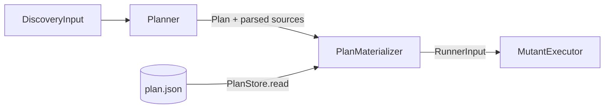

# Plans

← [Schematization](05-schematization.md) | [Index →](README.md)

---

A run is two decisions followed by work: *what* to mutate, then *whether each mutant survives*. Until plans, both happened in one process with nothing in between, so a run could not be split across machines, resumed after an interruption, audited before the hour was spent, or repeated for one mutant. A **plan** is the first decision written down.

## The plan

`Plan` (`Plan/Plan.swift`, `formatVersion` 1) holds the project (type, scheme, destination, test target), the scope (sources path, exclusions, operators), every source file in scope with the SHA-256 of its content, and every mutant with its file, UTF-8 range, line, column, operator, change, description, whether it is schematizable, and its fingerprint.

Three properties are the point:

| Property | How |
|---|---|
| **No absolute path** | Every path is relative to the project root (`Planner.relative`); the root is given again at run time. The same code in two directories, or on two machines, gives the same plan |
| **No execution option** | Timeout, concurrency, cache, reports and gate are the run's; a plan says what, not how fast |
| **Deterministic bytes** | Mutants are in file-then-offset order, files in path order, and `PlanStore.encode` writes sorted keys without escaped slashes and one trailing newline. `PlanStore.sha256(of:)` over those bytes is the plan's identity |

The schematized content is not in the plan: the run regenerates it from the mutants, which keeps a plan readable in a pull request.

## One path from mutants to a run

`Planner` runs discovery up to indexing — files, parsing, operators, mutation points, fingerprints — and produces the plan, handing over the parsed sources so the direct flow does not parse twice. `PlanMaterializer` turns a plan into a `RunnerInput`: it rebuilds every `IndexedMutationPoint` from the plan (the index is the mutant's position in the plan, so the report ids are the same ones a plain run gives), runs `SchematizationStage` and `IncompatibleRewritingStage` over the sources, and assembles the input. `DiscoveryPipeline.run` is now `Planner` followed by `PlanMaterializer` on the sources just parsed; `run --plan` is `PlanStore.read` followed by `PlanMaterializer` on the sources read from disk. **There is one materialization, so the two flows cannot drift**, and a test pins that a plan written and read back materializes to the direct flow's input.

## Staleness

Before `run --plan` builds anything, `PlanMaterializer.load` hashes every file of the plan again and compares; a changed or missing file ends the run with `PlanError.stale` or `.missingFile`, naming it. Then each mutant's `original` text is checked at its range, which catches a corrupt plan for free. A plan only ever runs over the code it describes; a shard on another machine that checked out the wrong commit finds out before it builds.

The `toolVersion` is recorded, not required: a plan says which tool made it, and `formatVersion` says whether this tool can read it.

## Shards

`Shard` is `i/n`, `1 ≤ i ≤ n`. `ShardSelector` partitions a plan **by file**: every mutant of a file goes to one shard, so a shard builds one schema holding only its mutants and no file is built twice. Files are taken in path order and each goes to the shard with the fewest mutants so far, ties to the lowest index; the partition is a pure function of the plan and `n`. A file heavier than its share still goes whole to one shard, so the balance is approximate. `run --plan --shard i/n` materializes only the shard's mutants, with their plan ids.

## Results and merge

Every JSON report carries `config.planSha256` and, for a shard, `config.shard` (`RunIdentity`), and every mutant carries its `fingerprint` and `activated`. A plain run has an identity too, since it made a plan in memory.

`ResultMerger` joins reports into one result set under three rules, each an error (`MergeError`): every report must name the same plan; no fingerprint may have a verdict in two reports; every mutant of the plan must have a verdict. Missing mutants are listed and no score is given — `discovered == planned + skipped` is the discipline, and a score over part of the plan would not be a single run's number. The merged `ExecutionResult`s are rebuilt from the plan's mutants and the reports' verdicts, so every reporter and the quality gate run over them unchanged.

## Resuming

`CacheStore` appends every verdict to `journal.jsonl` as soon as it is stored and replays the journal on `load()`, folding it into `results.json` on `persist()`. The cache's metadata (the test files' hashes) is written at the start of the run, so an interrupted run's journal is read back against the test files it ran with. The cache key is the file's content hash, the same the plan carries, so a `run --plan` resumes the same way, shard by shard. Nothing is indexed by plan: the content already is the identity.

## Reproduce

`Reproducer` runs one mutant of a plan — by report id, full fingerprint, or a prefix that fits one mutant — with `RunnerConfiguration.build.reproducing` set: the whole suite rather than the targeted suites first, no `OutputStopRule`, and the sandbox left in place by every executor. It prints the kept sandboxes (this process's `xmr-<pid>-*` directories), the line before and after the mutation (from `MutationRewriter`), the full test output (from `MutantLogWriter`'s log) and the verdict with its reason. The next run's sweep of orphaned sandboxes removes the kept one.

## Invariants

| Invariant | Enforcement |
|---|---|
| A plan has no absolute path | `Planner.relative` on every path; a test plans the same code in two directories and compares the bytes |
| Two plans of the same code are the same bytes | ordered mutants and files, `PlanStore.encode` with sorted keys |
| A plan never runs over other code | `PlanMaterializer.load` hashes every file before anything is built |
| The direct flow and `run --plan` give the same input | one `PlanMaterializer`; a test compares the two |
| Shards partition the plan | `ShardSelector` tests: union is the plan, intersection is empty |
| A merge is complete or it has no score | `ResultMerger` throws `MergeError.missing` |
| An interrupted run loses no verdict | the journal is written per verdict, before any report |
