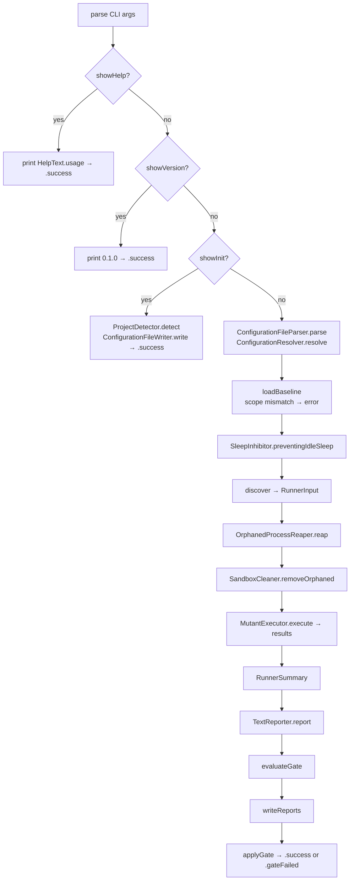

# Entry Point

← [Index](README.md) | Next: [Configuration →](02-configuration.md)

---

## SwiftMutationTesting.swift

```swift
@main
struct SwiftMutationTesting {
    static func main() async
    static func run(args: [String], launcher: (any ProcessLaunching)? = nil) async -> ExitCode
    private static func execute(args: [String], launcher: (any ProcessLaunching)?) async throws -> ExitCode
    private static func runPipeline(configuration: RunnerConfiguration, baseline: Baseline?, launcher: (any ProcessLaunching)?) async throws -> ExitCode
    private static func discover(configuration: RunnerConfiguration) async throws -> (RunnerInput, TimeInterval)
    static func writeReports(_ summary: RunnerSummary, configuration: RunnerConfiguration, gate: GateResult? = nil)
    static func loadBaseline(for configuration: RunnerConfiguration) throws -> Baseline?
    static func evaluateGate(_ summary: RunnerSummary, configuration: RunnerConfiguration, baseline: Baseline?) -> GateResult?
    static func applyGate(_ gate: GateResult?, summary: RunnerSummary, configuration: RunnerConfiguration, now: Date = Date()) throws -> ExitCode
    static func defaultLauncher(for projectType: ProjectType) -> any ProcessLaunching
}
```

The program entry point. `main()` installs signal handlers for sandbox cleanup (`SandboxCleaner.installSignalHandlers()`), then drops `CommandLine.arguments[0]` (the executable name) and delegates to `run(args:launcher:)`.

`run` catches two error categories before returning an exit code:
- `UsageError` — prints `message` to stderr
- Any other `Error` — prints `localizedDescription` to stderr (errors conforming to `LocalizedError`, such as `SimulatorError` and `BuildError`, provide structured descriptions)

`defaultLauncher(for:)` returns the appropriate process launcher based on project type: `XcodeProcessLauncher` for `.xcode`, `SPMProcessLauncher` for `.spm`. Used when no launcher is injected via the `launcher` parameter.

`execute` is the primary execution path:



`runPipeline` holds a `SleepInhibitor` assertion from discovery to the last report, so an unattended run does not stop while the machine sleeps. Before handing the mutants to `MutantExecutor` it kills test processes still running from the sandboxes of dead runs (`OrphanedProcessReaper().reap()`) and then sweeps those sandboxes (`SandboxCleaner.removeOrphaned()`); doing it here rather than in `main()` keeps `--help`, `--version` and `init` from paying for a directory listing they do not need.

`discover` runs `DiscoveryPipeline` and, when `quiet` is false, emits `.discoveryFinished` to a `ConsoleProgressReporter`.

`writeReports` writes `JsonReporter`, `HtmlReporter`, `SonarReporter`, `SarifReporter` and `MarkdownReporter` outputs when the corresponding output path is configured. The Markdown summary includes the gate result, which is why the gate is evaluated before the reports are written. Each reporter failure prints a warning to stderr without aborting.

`loadBaseline` reads the baseline named by `--baseline` before anything runs and compares its scope with the run's (`BaselineScope.differences`). A missing, unreadable or out-of-scope baseline throws `GateError`, so the run ends with `.error` before a single mutant is built.

`evaluateGate` returns `nil` when the gate is inactive, and `QualityGate`'s result otherwise. `applyGate` runs after the reports: it prints that result with `GateReporter` and returns `.gateFailed` if a check failed; then, when `--write-baseline` was given, it writes this run's baseline whatever the outcome. See [10 — Quality Gate](10-quality-gate.md).

---

## CLI/ExitCode.swift

```swift
enum ExitCode: Int32 {
    case success    = 0
    case error      = 1
    case gateFailed = 2
}
```

Passed directly to `exit(_:)` as `rawValue`. All error conditions (usage, build, baseline, unexpected) map to `.error`. `.gateFailed` means the run completed and its reports were written, but the quality gate did not pass, so CI can tell a failed gate from a broken run.

---

## CLI/HelpText.swift

```swift
enum HelpText {
    static let usage: String
}
```

A static multi-line string printed when `--help` is passed. Describes all CLI options and subcommands. Not reproduced here — see the source file.

---

## CLI/UsageError.swift

```swift
struct UsageError: Error, Sendable {
    let message: String
}
```

Thrown by `CommandLineParser` for unknown flags and by `ConfigurationResolver` when required fields are absent in both CLI and file values (e.g. `scheme` and `destination` for Xcode projects).

| Field | Type | Description |
|---|---|---|
| `message` | `String` | Human-readable description printed to stderr |

---

← [Index](README.md) | Next: [Configuration →](02-configuration.md)
