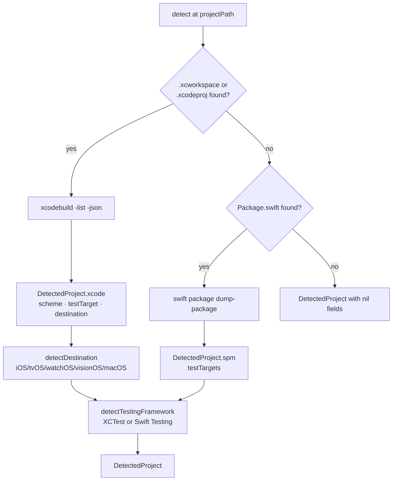

# Configuration

← [Entry Point](01-entry-point.md) | Next: [Discovery Pipeline →](03-discovery-pipeline.md)

---

## CLI/CommandLineParser.swift

```swift
struct CommandLineParser: Sendable {
    func parse(_ args: [String]) throws -> ParsedArguments
}
```

The first word may be a command — `run` (the default when none is given), `init`, `plan`, `merge` or `reproduce` — then the words before the first flag are the command's positionals (the project path for `run` and `plan`; the result files for `merge`; the mutant and an optional project path for `reproduce`), then the flags. Iterates the flags left-to-right, dispatching each token to an internal `applyFlag` method. Stores intermediate state in a private `FlagValues` struct. Throws `UsageError` for unrecognised flags, for `--shard` outside `run` and for a shard that is not `i/n`. For `plan`, `--output` is the plan's path, not a report's. `--project <path>` sets the project path of `merge`, whose positionals are the result files, and is refused elsewhere.

Multi-value flags (`--exclude`, `--operator`, `--disable-mutator`) accumulate into arrays. Boolean flags (`--no-cache`, `--help`, `--version`, `init`, `--quiet`) set a single Bool. All other flags consume the next token as their value.

---

## CLI/ParsedArguments.swift

```swift
struct ParsedArguments: Sendable {
    enum Command: Sendable, Equatable { case run, plan, merge, reproduce }

    var command: Command = .run
    var projectPath: String = "."
    var showVersion: Bool = false
    var showHelp: Bool = false
    var showInit: Bool = false
    var plan: PlanOptions = PlanOptions()    // path (--plan, or plan's --output), shard, results, mutant
    var build: BuildOptions = BuildOptions()
    var reporting: ReportingOptions = ReportingOptions()
    var filter: FilterOptions = FilterOptions()
    var gate: GateOptions = GateOptions()

    struct BuildOptions: Sendable {
        var scheme: String?
        var destination: String?
        var testTarget: String?
        var timeout: Double?
        var buildTimeout: Double?
        var concurrency: Int?
        var noCache: Bool = false
        var testingFramework: String?
    }

    struct ReportingOptions: Sendable {
        var output: String?
        var htmlOutput: String?
        var sonarOutput: String?
        var sarifOutput: String?
        var markdownOutput: String?
        var keepLogsPath: String?
        var quiet: Bool = false
    }

    struct FilterOptions: Sendable {
        var sourcesPath: String?
        var excludePatterns: [String] = []
        var operators: [String] = []
        var disabledMutators: [String] = []
    }

    struct GateOptions: Sendable {
        var minScore: Double?
        var baseline: String?
        var maxScoreDrop: Double?
        var maxNewSurvivors: Int?
        var writeBaseline: String?
    }
}
```

| Field | Default | Description |
|---|---|---|
| `projectPath` | `"."` | First positional argument, or `"."` if absent |
| `showHelp` | `false` | Set by `--help` |
| `showVersion` | `false` | Set by `--version` |
| `showInit` | `false` | Set by the `init` subcommand |
| `build.scheme` | `nil` | `--scheme <value>` |
| `build.destination` | `nil` | `--destination <value>` |
| `build.testTarget` | `nil` | `--target <value>` |
| `build.testingFramework` | `nil` | `--testing-framework <xctest\|swift-testing>` |
| `build.timeout` | `nil` | `--timeout <seconds>` |
| `build.buildTimeout` | `nil` | `--build-timeout <seconds>` |
| `build.concurrency` | `nil` | `--concurrency <n>` |
| `build.noCache` | `false` | `--no-cache` |
| `reporting.output` | `nil` | `--output <path>` |
| `reporting.htmlOutput` | `nil` | `--html-output <path>` |
| `reporting.sonarOutput` | `nil` | `--sonar-output <path>` |
| `reporting.sarifOutput` | `nil` | `--sarif-output <path>` |
| `reporting.markdownOutput` | `nil` | `--markdown-output <path>` |
| `reporting.keepLogsPath` | `nil` | `--keep-logs <directory>` |
| `reporting.quiet` | `false` | `--quiet` |
| `filter.sourcesPath` | `nil` | `--sources-path <path>` |
| `filter.excludePatterns` | `[]` | `--exclude <pattern>`, repeatable |
| `filter.operators` | `[]` | `--operator <id>`, repeatable |
| `filter.disabledMutators` | `[]` | `--disable-mutator <id>`, repeatable |
| `filter.operatorTier` | `nil` | `--operator-tier <tier>` |
| `gate.minScore` | `nil` | `--min-score <0-100>` |
| `gate.baseline` | `nil` | `--baseline <path>` |
| `gate.maxScoreDrop` | `nil` | `--max-score-drop <points>`, `0` allowed |
| `gate.maxNewSurvivors` | `nil` | `--max-new-survivors <n>` |
| `gate.writeBaseline` | `nil` | `--write-baseline <path>` |

`CommandLineParser` applies each flag through one function per option group — build, reporting, filter and gate — and reports an unknown option when none of them takes it.

---

## Configuration/RunnerConfiguration.swift

```swift
struct RunnerConfiguration: Sendable {
    let projectPath: String
    let build: BuildOptions
    let reporting: ReportingOptions
    let filter: FilterOptions
    var gate: GateOptions = GateOptions()

    static let defaultXcodeTimeout: Double   // 120.0
    static let defaultSPMTimeout: Double     // 30.0
    static let defaultBuildTimeout: Double   // 120.0
    static let defaultConcurrency: Int       // max(1, processorCount - 1)

    struct BuildOptions: Sendable {
        var projectType: ProjectType
        var testTarget: String?
        var timeout: Double
        var concurrency: Int
        var noCache: Bool
        var testingFramework: TestingFramework  // default: .swiftTesting
    }

    struct ReportingOptions: Sendable {
        var output: String?
        var htmlOutput: String?
        var sonarOutput: String?
        var sarifOutput: String?
        var markdownOutput: String?
        var quiet: Bool
    }

    struct FilterOptions: Sendable {
        var sourcesPath: String?
        var excludePatterns: [String]
        var operators: [String]
    }

    struct GateOptions: Sendable {
        var policy: GatePolicy          // default: no policy
        var baselinePath: String?
        var writeBaselinePath: String?
        var isActive: Bool { get }      // a policy is set, or a baseline is given
    }
}
```

Fully resolved configuration passed to both pipelines. Organized into four nested option groups: build, reporting, filter and gate. `gate` defaults to an inactive gate, so a run without gate settings behaves as it did before the gate existed.

| Constant | Value |
|---|---|
| `defaultXcodeTimeout` | `120.0` |
| `defaultSPMTimeout` | `30.0` |
| `defaultBuildTimeout` | `120.0` |
| `defaultConcurrency` | `max(1, ProcessInfo.processorCount - 1)` |

---

## Configuration/ProjectType.swift

```swift
enum ProjectType: Sendable, Equatable {
    case xcode(scheme: String, destination: String)
    case spm
}
```

Xcode projects carry a scheme and destination. SPM projects require neither — `swift build` and `swift test` use the `Package.swift` manifest directly.

---

## Configuration/TestingFramework.swift

```swift
enum TestingFramework: String, Sendable {
    case xctest
    case swiftTesting = "swift-testing"
}
```

Detected automatically by `ProjectDetector` via source file scanning. Influences test output parsing patterns.

---

## Configuration/ConfigurationResolver.swift

```swift
struct ConfigurationResolver: Sendable {
    func resolve(cliArguments: ParsedArguments, fileValues: [String: String]) throws -> RunnerConfiguration
}
```

Merges `ParsedArguments` (CLI, higher priority) with `[String: String]` from the YAML parser (lower priority). CLI values always win.

For Xcode projects, throws `UsageError` if `scheme` or `destination` is absent in both sources. SPM projects are auto-detected when a `Package.swift` exists and no `.xcodeproj`/`.xcworkspace` is found.

**Operator resolution** (`resolveOperators`), which always yields the full list of identifiers to run:

1. An explicit list — `--operator` (CLI) or `operators` (file), CLI first — is used as is, whatever the operators' tiers
2. Otherwise the tier is resolved — `--operator-tier`, else `operator-tier`, else `.default`; a name that is no tier is a `UsageError` — and `DiscoveryPipeline.operatorNames(upTo:)` gives its set, minus the identifiers disabled by `--disable-mutator` (CLI), `disabled-mutators` or the `mutators` block with `active: false` (file), both removed together

**Gate resolution** (`resolveGate`): each policy comes from its flag or, failing that, from `min-score`, `max-score-drop` and `max-new-survivors` in the file. `baseline` and `--write-baseline` are resolved against the project path unless absolute. Throws `UsageError` when `min-score` is outside 0–100, a maximum is negative, a file value is not a number, `max-score-drop` or `max-new-survivors` is set without a baseline, or the baseline file does not exist.

---

## Configuration/ConfigurationFileParser.swift

```swift
struct ConfigurationFileParser: Sendable {
    func parse(at projectPath: String) throws -> [String: String]
}
```

Reads `.swift-mutation-testing.yml` from `<projectPath>/.swift-mutation-testing.yml`. Returns an empty dictionary if the file does not exist.

Parses YAML line-by-line. Handles top-level scalar values and a `mutators:` block where each entry can have an `active: false` sub-key. Disabled mutator names are collected under the key `"disabledMutators"` (comma-separated) in the returned dictionary.

---

## Configuration/ConfigurationFileWriter.swift

```swift
struct ConfigurationFileWriter: Sendable {
    func write(to projectPath: String, project: DetectedProject) throws
}
```

Writes `.swift-mutation-testing.yml` at `<projectPath>/.swift-mutation-testing.yml`. Throws if the file already exists.

Generates YAML content using `DetectedProject` values where available, falling back to placeholder comments. Fixed values in the generated file:

- `timeout: 60` — matches `RunnerConfiguration.defaultTimeout`
- `concurrency` — written as a comment (`# concurrency: 4`); the code default (`max(1, CPU count - 1)`) applies when absent
- quality gate keys — `min-score`, `baseline`, `max-score-drop` and `max-new-survivors`, all commented
- `mutators:` block — one `- name: / active: true` entry per operator from `DiscoveryPipeline.allOperatorNames`; user sets `active: false` to disable individual operators

---

## Configuration/ProjectDetector.swift

```swift
struct ProjectDetector: Sendable {
    init(launcher: any ProcessLaunching)
    func detect(at projectPath: String) async -> DetectedProject
    private func findContainer(in: String) -> (flag: String, path: String)?
    private func listProject(container:workingDirectory:) async -> (schemes: [String], projectName: String?, testTarget: String?)
    private func listSPMTestTargets(in: String) async -> [String]
    private func detectDestination(in: String) async -> String
    private func detectTestingFramework(at:testTarget:) -> TestingFramework
}
```

Auto-detects the project type, scheme, test targets, destination, and testing framework.



`detectDestination` queries `xcrun simctl list devices --json` and picks the first booted or available simulator for the detected platform. Falls back to hardcoded default destinations if detection fails.

`detectTestingFramework` scans test target source files for `import Testing` (Swift Testing) or `import XCTest` patterns to determine the testing framework in use.

---

## Configuration/DetectedProject.swift

```swift
struct DetectedProject: Sendable {
    let kind: Kind
    let testTarget: String?
    let testingFramework: TestingFramework

    enum Kind: Sendable {
        case xcode(scheme: String?, allSchemes: [String], destination: String)
        case spm(testTargets: [String])
    }
}
```

| Field | Description |
|---|---|
| `kind` | `.xcode` with scheme, allSchemes, destination; or `.spm` with testTargets |
| `testTarget` | First test target found, or `nil` |
| `testingFramework` | Detected framework (`.xctest` or `.swiftTesting`) |

Computed properties `scheme`, `allSchemes`, and `destination` extract values from `.xcode` kind for convenience.

---

← [Entry Point](01-entry-point.md) | Next: [Discovery Pipeline →](03-discovery-pipeline.md)
