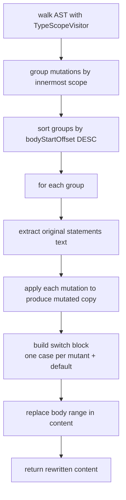

# Schematization

← [Mutation Operators](04-mutation-operators.md) | Next: [Sandbox & Build →](06-sandbox-build.md)

---

## Discovery/Schematization/SchemataGenerator.swift

```swift
struct SchemataGenerator: Sendable {
    func generate(source: ParsedSource, mutations: [(index: Int, point: MutationPoint)]) -> SchemaGeneration
}

struct SchemaGeneration: Sendable {
    let content: String
    let discarded: [MutationPoint]
}
```

Rewrites a source file to embed all its schematizable mutations into `switch __swiftMutationTestingID_<hash>` blocks, the hash naming the file. Returns the complete rewritten source as `content`, and as `discarded` the mutations it could not place: a point inside no function body, a body whose statements could not be extracted, or a mutation whose text does not fit inside the body it belongs to. A discarded mutation gets no `case`, so `ApplicationVerifier` finds it missing from the sandbox and stops the run rather than letting a mutant that is not in the build be judged. Uses force-unwrapped UTF-8 conversions because Swift source code is guaranteed to be valid UTF-8.



Groups are processed in reverse `bodyStartOffset` order so that earlier replacements do not invalidate the byte offsets of later ones.

**Generated switch structure**, for a body of statements:

```swift
{
switch __swiftMutationTestingID_<hash> {
case "swift-mutation-testing_<n>":
let _ = __SwiftMutationTesting_<hash>.activated()
<mutated statements>
default:
<original statements>
}
}
```

Every `case` starts by recording that it ran (`SupportDeclarations.activationCall(for:)`). The scope's `FunctionBodyShape` decides how: a body that is one expression keeps each case a single expression, `(__SwiftMutationTesting_<hash>.activated(), <mutated expression>).1`, because such a body is an implicit return and the `switch` is then an expression; a body that is one `if` or `switch` expression in a value-returning scope gets `return` in front of every branch, `default` included. A blank mutated body — a removed sole statement — records the activation alone. The reasoning is in [Architecture — Activation Marker](../Architecture/05-schematization.md#activation-marker).

Mutant IDs follow `"swift-mutation-testing_<index>"` where `index` is the global sequential index assigned by `MutantIndexingStage`. Scopes are rewritten innermost first, and an enclosing scope reads its statements from the content already rewritten, with its offsets shifted by the edits inside it, so a nested function keeps its own `switch` inside every branch of the enclosing one. When at least one body was rewritten, the file ends with `SupportDeclarations.perFile(for:)`.

---

## Discovery/Schematization/MutationRewriter.swift

```swift
struct MutationRewriter: Sendable {
    func rewrite(source content: String, applying mutation: MutationPoint) -> String
}
```

Applies a single mutation to a complete source file via raw UTF-8 byte replacement. Used exclusively for incompatible mutants.

Converts the source content to `Data`, replaces the subrange `utf8Offset ..< utf8Offset + originalText.utf8.count` with `mutatedText.data(using: .utf8)!`, and converts back to `String`. Uses force-unwrapped UTF-8 conversions because Swift source code is guaranteed to be valid UTF-8.

---

## Discovery/Schematization/TypeScopeVisitor.swift

```swift
final class TypeScopeVisitor: SyntaxVisitor {
    func isSchematizable(utf8Offset: Int) -> Bool
    func innermostScope(containing utf8Offset: Int) -> FunctionBodyScope?
}
```

Walks the AST and records every `FunctionBodyScope`. Records scopes for:

- `FunctionDeclSyntax`
- `InitializerDeclSyntax`
- `DeinitializerDeclSyntax`
- `AccessorDeclSyntax`

`isSchematizable(utf8Offset:)` returns `true` if any recorded scope contains the given offset.

`innermostScope(containing:)` returns the tightest scope that contains the offset, enabling correct handling of nested functions and closures.

---

## Discovery/Schematization/FunctionBodyScope.swift

```swift
struct FunctionBodyScope: Sendable {
    let bodyStartOffset: Int
    let bodyEndOffset: Int
    let statementsStartOffset: Int
    let statementsEndOffset: Int
    var shape: FunctionBodyShape = .statements
}
```

UTF-8 byte offsets describing one function body, and its shape.

| Field | Description |
|---|---|
| `bodyStartOffset` | Byte offset of the opening `{` |
| `bodyEndOffset` | Byte offset immediately after the closing `}` |
| `statementsStartOffset` | Byte offset of the first statement |
| `statementsEndOffset` | Byte offset immediately after the last statement |
| `shape` | What the body is made of, see `FunctionBodyShape` |

---

## Discovery/Schematization/FunctionBodyShape.swift

```swift
enum FunctionBodyShape: Sendable, Equatable {
    case statements
    case expression
    case conditional(returnsValue: Bool)
}
```

| Case | Body | Recorded by `TypeScopeVisitor` when |
|---|---|---|
| `.statements` | zero, several, or one statement that is not an expression (`return x`) | anything else |
| `.expression` | exactly one expression statement, `{ a + b }` or `{ print(1) }` | the single item is an `ExprSyntax` other than `if`/`switch` |
| `.conditional(returnsValue:)` | exactly one `if` or `switch` expression | the single item is an `IfExprSyntax` or `SwitchExprSyntax`; `returnsValue` is `true` for a function with a return type other than `Void`/`()` and for a `get` accessor, `false` for `init`, `deinit`, setters and observers |

`SchemataGenerator` uses the shape to place the activation call without breaking an implicit return.

---

## Discovery/Schematization/SchematizedFile.swift

```swift
struct SchematizedFile: Sendable, Codable {
    let originalPath: String
    let schematizedContent: String
}
```

| Field | Description |
|---|---|
| `originalPath` | Absolute path of the original source file |
| `schematizedContent` | Source text with all schematizable mutations embedded |

`schematizedContent` ends with `SupportDeclarations.perFile(for:)`, so the file declares the `__swiftMutationTestingID_<hash>` its schema reads. Nothing else in the sandbox declares it.

---

## Discovery/Schematization/SupportDeclarations.swift

```swift
enum SupportDeclarations {
    static func suffix(for path: String) -> String          // eight hex digits of SHA-256(path)
    static func identifier(for path: String) -> String      // "__swiftMutationTestingID_<suffix>"
    static func activationCall(for path: String) -> String  // "__SwiftMutationTesting_<suffix>.activated()"
    static func perFile(for path: String) -> String
}
```

The block `SchemataGenerator` appends to every file it changes, named after the file by `suffix(for:)`: `import Foundation`, a `@usableFromInline internal enum` whose `nonisolated static let id` reads `__SWIFT_MUTATION_TESTING_ACTIVE` from the environment once and whose `activated()` creates the file named by `__SWIFT_MUTATION_TESTING_ACTIVATION_FILE` the first time it is called (`activationRecorded` makes every later call a bool read), and a `@usableFromInline nonisolated internal var __swiftMutationTestingID_<suffix>` that returns the id. `identifier(for:)` is the name the generator writes after `switch`, `activationCall(for:)` the text of the call it writes into each `case`. It is appended only when at least one schema was written, so a file whose mutations were all skipped is returned untouched. Why each part is what it is: [Architecture — Per-file support declarations](../Architecture/05-schematization.md#per-file-support-declarations).

---

← [Mutation Operators](04-mutation-operators.md) | Next: [Sandbox & Build →](06-sandbox-build.md)
