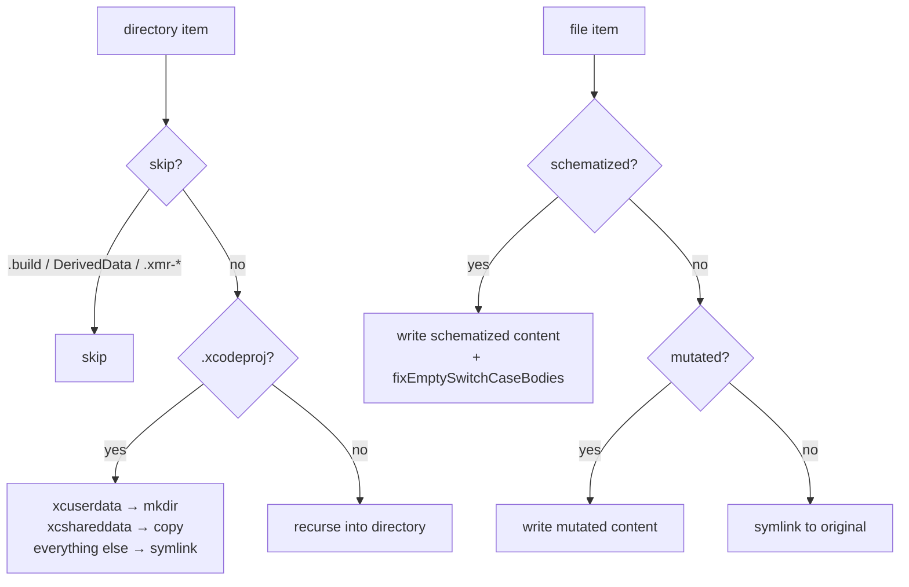

# Sandbox & Build

← [Schematization](05-schematization.md) | Next: [Execution →](07-execution.md)

---

## Sandbox/SandboxFactory.swift

```swift
struct SandboxFactory: Sendable {
    func create(
        projectPath: String,
        schematizedFiles: [SchematizedFile],
        supportFileContent: String
    ) async throws -> Sandbox

    func createClean(
        projectPath: String
    ) async throws -> Sandbox

    func create(
        projectPath: String,
        mutatedFilePath: String,
        mutatedContent: String
    ) async throws -> Sandbox
}
```

Creates an isolated copy of the project in `$TMPDIR/swift-mutation-testing/xmr-<pid>-<UUID>/`, where `<pid>` is the process that created it. Supports both Xcode and SPM projects. The original project is never modified.

**Three factory methods:**

| Method | Used by | Description |
|---|---|---|
| `create(projectPath:schematizedFiles:supportFileContent:)` | `MutantExecutor` for schematizable path | Embeds all schematized files; injects support file; disables SwiftLint phases |
| `createClean(projectPath:)` | `IncompatibleMutantExecutor` for SPM shared sandbox | Clean sandbox without mutations; mutated files are written directly later |
| `create(projectPath:mutatedFilePath:mutatedContent:)` | `IncompatibleMutantExecutor` for Xcode path | Writes a single mutated file; no support file injection |

**Copy strategy:**



**Post-processing steps (schematizable overload only):**

1. `injectSupportFile` — writes `__SMTSupport.swift` to the sandbox `Sources/` directory (or appends to the first schematized file if no `Sources/` directory exists). When the destination is an Xcode target (not macOS/SPM), transforms the computed property form to a `nonisolated(unsafe)` stored variable.

2. `disableSwiftLintBuildPhases` — patches `project.pbxproj`, replacing the `shellScript` of every `PBXShellScriptBuildPhase` that contains `swiftlint` with `exit 0\n`.

3. `fixEmptySwitchCaseBodies` — post-processes each schematized file after writing. Inserts a `break` statement into any `case "..."` block immediately followed by another case or default, preventing Swift compiler errors when `RemoveSideEffects` removes the only statement in a function body.

---

## Sandbox/Sandbox.swift

```swift
struct Sandbox: Sendable {
    let rootURL: URL
    func cleanup() throws
}
```

A lightweight wrapper around the sandbox root URL.

| Field | Description |
|---|---|
| `rootURL` | Absolute URL of the `xmr-<pid>-<UUID>` directory in `$TMPDIR` |

`cleanup()` removes the entire `rootURL` directory tree via `FileManager.default.removeItem(at:)`.

---

## Sandbox/SandboxName.swift

```swift
enum SandboxName {
    static let prefix: String
    static var directory: URL { get }
    static func make(pid: pid_t = getpid()) -> String
    static func ownerPID(of name: String) -> pid_t?
    static func isOwnerAlive(of name: String) -> Bool
}
```

The one place that knows how a sandbox directory is named and where it lives, so that the side that creates them and the side that deletes them cannot drift apart. `directory` is `$TMPDIR/swift-mutation-testing/`; `make()` produces `xmr-<pid>-<UUID>`; `ownerPID(of:)` reads the pid back, or `nil` when the name was not made by this scheme; `isOwnerAlive(of:)` answers whether that process still exists. See **Ownership** under `SandboxCleaner` below for what the sweep does with the answer.

---

## Sandbox/SandboxCleaner.swift

```swift
enum SandboxCleaner {
    static func removeOrphaned(in directory: URL = SandboxName.directory)
    static func register(_ sandbox: Sandbox, in registry: SandboxRegistry = .shared)
    static func deregister(in registry: SandboxRegistry = .shared)
    static func cleanupActiveSandbox(in registry: SandboxRegistry = .shared)
    static func terminate(registry: SandboxRegistry = .shared, exit: (Int32) -> Void = SignalTarget.process.exit)
    static func installSignalHandlers()
    static func withSignalTarget<T>(_ target: SignalTarget, _ body: () throws -> T) rethrows -> T

    struct SignalTarget: Sendable {
        static let process: SignalTarget
        let registry: SandboxRegistry
        let exit: @Sendable (Int32) -> Void
    }
}
```

Handles cleanup of orphaned and active sandbox directories.

| Method | Description |
|---|---|
| `removeOrphaned(in:)` | Scans the directory for `xmr-*` entries and removes the ones whose owning process is gone. Called by `runPipeline` before `MutantExecutor` runs, to clean up sandboxes from interrupted runs |
| `register(_:in:)` | Records the sandbox as the active one in the registry |
| `deregister(in:)` | Forgets the active sandbox without touching the directory |
| `cleanupActiveSandbox(in:)` | Removes the active sandbox directory, if one is registered |
| `terminate(registry:exit:)` | What a signal does: removes the active sandbox, then calls `exit(1)` |
| `installSignalHandlers()` | Installs `SIGINT` and `SIGTERM` handlers that call `terminate` with the current `SignalTarget` |
| `withSignalTarget(_:_:)` | Points the installed handler at another registry and exit for the length of `body`, then restores `SignalTarget.process` |

A C signal handler cannot capture anything, so what it cleans and how it exits come from a module-level `Mutex<SignalTarget>`. In a run it always holds `SignalTarget.process` — the shared registry and `_exit` — and nothing but the handler ever takes the lock. `withSignalTarget` exists so a test can invoke the handler that was really installed without removing another test's sandbox or ending the test process; it replaces the mutable exit-handler global the handler used to read, which tests swapped without any synchronisation.

**Ownership.** The sweep used to run at startup, before arguments were parsed, and it deleted every `xmr-*` directory in `$TMPDIR` on the grounds that a sandbox found at startup must belong to a run that is over. It does not: a second invocation — `--help` included — destroyed the sandbox of a run already in progress, and that run then reported every remaining mutant as unviable, or died without writing a report (#86, reported by @jwp23 with the mechanism pinned to the line).

The name now carries the owner: `SandboxName.make()` puts the creating process's pid in the directory name, and the sweep keeps any directory whose pid is still alive (`kill(pid, 0)`, treating `EPERM` as alive — the process exists, it is simply not ours to signal). Putting the pid in the name rather than in a file inside the directory is what makes this safe without a lock: the directory is named by `createDirectory` itself, so there is no window in which a live sandbox looks unowned.

A name that does not parse — anything from a version before this, or a foreign directory that happens to start with `xmr-` — is treated as orphaned, which preserves the old behaviour for leftovers. Parsing is strict about both halves: the pid must be positive, and the remainder must be a well-formed UUID, so an old `xmr-<UUID>` whose UUID opens with digits is not read as a pid and left behind forever.

The one case this does not cover is a crashed run whose pid has since been reused by an unrelated process: its sandbox is kept rather than swept. That leaks a temp directory until the system purges `$TMPDIR`; it does not lose anyone's data, which is the trade the old behaviour got backwards.

**Where the sweep looks, and when.** Up to 1.5.0 sandboxes were created loose in `$TMPDIR` and the sweep ran in `main()`, before arguments were parsed. Listing a directory costs time in proportion to everything in it, not just our entries, and `$TMPDIR` is shared with every other tool on the machine: with a few hundred thousand leftovers from other test suites, `--version` took twenty seconds, all of it inside `contentsOfDirectory`. Sandboxes now live in a directory of their own, so the sweep lists only what this tool created, and it runs from `runPipeline` right before mutants are executed, so commands that never execute any never pay for it. Sandboxes an older version left loose in `$TMPDIR` are not swept; macOS purges them from `$TMPDIR` on its own.

---

## Sandbox/OrphanedProcessReaper.swift

```swift
struct OrphanedProcessReaper: Sendable {
    var processes: @Sendable () -> [pid_t]
    var arguments: @Sendable (pid_t) -> [String]?
    var descendants: @Sendable (pid_t) -> [pid_t]
    var isOwnerAlive: @Sendable (String) -> Bool
    var kill: SystemCalls.Kill

    @discardableResult func reap() -> [pid_t]
    static func sandboxName(in arguments: [String]) -> String?
}
```

Kills test processes left running by a run that is gone. `runPipeline` calls `reap()` right before `SandboxCleaner.removeOrphaned()`.

A run that is killed with `SIGKILL` or crashes never reaches the signal handler, so a mutant stuck in a loop at that moment keeps running forever, reparented to `launchd` (#105). The directory sweep does not help: it removes the sandbox and leaves the process, which keeps running from its unlinked bundle. The reaper therefore looks at processes rather than directories. It reads each process's `argv` (`ProcessArguments`), looks for a path component that `SandboxName.ownerPID(of:)` accepts — `swiftpm-testing-helper` always carries one in `--test-bundle-path` — and kills the process and its descendants when that owner is no longer alive.

Two rules keep it from killing anything that is not ours:

- **Only strict sandbox names are matched.** `xmr-<pid>-<UUID>` must parse, and the owner must be dead by the same test the directory sweep uses. A legacy `xmr-<UUID>` name has no owner to check, so it is left alone.
- **Only the current user's processes are visible.** `KERN_PROCARGS2` refuses to read another user's arguments. The current process, and anything in a sandbox it owns, is skipped.

Every dependency is injectable, so the tests exercise each rule with a recording `kill` and one real orphan, a `tail -f` inside a dead run's sandbox.

---

## Sandbox/SandboxRegistry.swift

```swift
final class SandboxRegistry: Sendable {
    static let shared: SandboxRegistry
    func register(_ sandbox: Sandbox)
    func deregister()
    func cleanup()
}
```

Holds the path of the sandbox a signal should remove. The path is a C string, because a C signal handler cannot capture Swift context, and the pointer to it lives in an `Atomic<Int>`: every operation takes the pointer out with a single `exchange`, so exactly one caller ever owns — and frees — a given pointer, and a signal arriving mid-`deregister` finds either the path or nothing, never a half-freed one.

Before this it was a `nonisolated(unsafe)` global read and cleared in two steps. A run only ever touches it from one task, but the test suite runs `MutantExecutor` from several tests at once, and two of them clearing it together freed the same pointer twice: the test process died with `SIGABRT` often enough to fail CI on unrelated changes. `SandboxCleaner`'s methods take the registry as a parameter defaulting to `shared`, so the tests of the mechanism use a registry of their own and the executor tests cannot disturb them.

---

## Build/BuildStage.swift

```swift
struct BuildStage: Sendable {
    let launcher: any ProcessLaunching

    func build(
        sandbox: Sandbox,
        scheme: String,
        destination: String,
        timeout: Double
    ) async throws -> BuildArtifact

    func buildSPM(
        sandbox: Sandbox,
        timeout: Double
    ) async throws -> BuildArtifact
}
```

Runs a single build inside the sandbox.

**Xcode path (`build`):**

```mermaid
flowchart TD
    A[xcodebuild build-for-testing\n-scheme -destination\n-derivedDataPath sandbox/.xmr-derived-data] --> B{exit code?}
    B -- non-zero --> FAIL[throw BuildError.compilationFailed]
    B -- 0 --> C[search Build/Products for .xctestrun]
    C -- not found --> NFE[throw BuildError.xctestrunNotFound]
    C -- found --> D[Data(contentsOf: xctestrunURL)]
    D --> E[XCTestRunPlist(data)]
    E -- nil --> NFE2[throw BuildError.xctestrunNotFound]
    E -- plist --> F[BuildArtifact]
```

Auto-detects project format: prefers `-workspace` if a `.xcworkspace` exists, falls back to `-project` for `.xcodeproj`.

**SPM path (`buildSPM`):** Runs `swift build --build-tests` in the sandbox directory. Returns a `BuildArtifact` with the sandbox path (no `.xctestrun` needed).

Derived data is placed at `<sandbox>/.xmr-derived-data` to keep it inside the sandbox directory.

---

## Build/BuildArtifact.swift

```swift
struct BuildArtifact: Sendable {
    let derivedDataPath: String
    let xctestrunURL: URL
    let plist: XCTestRunPlist
}
```

| Field | Description |
|---|---|
| `derivedDataPath` | Path passed to `-derivedDataPath`; reused by `test-without-building` |
| `xctestrunURL` | URL of the `.xctestrun` file in `Build/Products` |
| `plist` | Parsed representation of the `.xctestrun` plist |

---

## Build/BuildError.swift

```swift
enum BuildError: Error, Equatable, LocalizedError {
    case compilationFailed(output: String)
    case timedOut(seconds: Double, output: String)
    case xctestrunNotFound

    var errorDescription: String? { get }
}
```

Conforms to `LocalizedError` to provide structured error descriptions that propagate through generic `catch` blocks.

| Case | Condition | Handling |
|---|---|---|
| `compilationFailed(output:)` | Build exits with non-zero code | Caught by `MutantExecutor`; triggers `FallbackExecutor` |
| `timedOut(seconds:output:)` | Build did not finish within `--build-timeout` | Ends the run rather than reporting the mutants unviable — a build that ran out of time says nothing about them |
| `xctestrunNotFound` | No `.xctestrun` in `Build/Products`, or plist parse failure | Propagates; fatal |

---

← [Schematization](05-schematization.md) | Next: [Execution →](07-execution.md)
